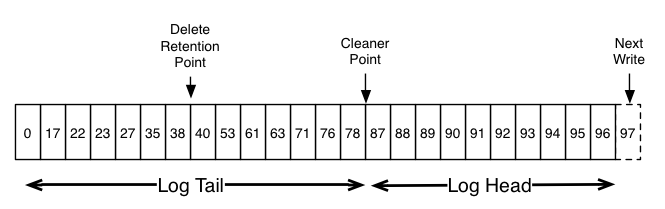

# Kafka 101

Stefan Siegl (@stesie23, <rolf@mayflower.de>)

<!--s-->

# Kafka Basics


<!--v-->

# Messages

* consist Key & Value
* internally represented as binary data
* typically: JSON or Avro

<!--v-->

# Topics

* ... are a "category" of messages
* (boundary as of a DDD aggregate)
* ... are partitioned

<!--v-->

# Partitions

* "commit log" of new messages
* always appended
* messages only ordered within partition
* base of replication
* 1 Leader, 0..n Follower

<!--v-->


<!--v-->

# Producer

* publishes messages onto a topic
* producer decides onto which partition
* messages without a key, typically round-robin
* with a key, based on a hash over the key (mod n)

<!--v-->

# Consumer

* fetches messages from a topic
* progress (so-called "offset") is tracked by the consumer(!)
   * via Commit onto internal topic
* messages remain on the topic
* arbitrary number of parallel consumers on a topic

<!--v-->


<!--v-->

# Consumer Groups

* "Label" which multiple consumers can use to sync among each other
* just a simple string
* distribution happens on partition level
* i.e. never two consumers will share a single "half" partition
* number of partitions is upper bound for consumers within a group

<!--v-->


<!--v-->

# Number of Partitions

* (extremely) hard to change
* use many enouch so you can scale
* number should be divisible by number of consumers without rest  
  otherwise imbalance of load
* usually like 12 or 40

<!--v-->

# Log Compaction

* what happens to "old" messages?
* two "types" of messages
   * Event Stream
   * Aggregated Data
* Log Compaction eliminates old messages with the same key

<!--v-->



<!--s-->

# Usage Pattern
<!--v-->

## Queue

* one process adds tasks to a queue + bunch of worker nodes processing each
* arbitrary number of services is part of a *single* consumer group
* if tasks are stateless, no key is needed (-> round-robin distribution)
* if workers aggregate events, provide key to partition on

<!--v-->

## Pub/Sub

* event is published + plenty of "interested" parties
* each service is part of *its own* consumer group
* consequence: each service will receive the event for processing

<!--v-->

## Mix of both

* e.g. events are published, multiple services with many instances of each
* every kind of service has its own consumer group
* instances of the same service are part *of the same* consumer group

<!--v-->

## Replay

* as consumers track the offsets on their own, they can seek back to the beginning
* new service may decide to process "from now on" or "from the beginnig"

<!--s-->

# Scalability

* Kafka's brokers are pretty dumb
* much of the work is done by Producers & Consumers
* consequence: differences in features of client libraries (e.g. Java vs. PHP)
   * e.g. PHP `nmred/kafka-php` always produces in round robin mode (regardless of Key)

<!--s-->

# TL;DR

Kafka is nice, if ...
* ... message retention is of advantage
* ... you need the scalability
* ... fun to work with if you're on the JVM

<!--s-->

# kafka-streams

<!--v-->

## kafka-streams

* java library for stream processing
* cares for
   * distribution among instances
   * error handling
   * windowing
   * state distribution/management

<!--v-->

## two different APIs

* Streams DSL (= high-level)
* Processor API (= low-level)

<!--s-->

# Examples

<!--v-->

## Stateless Processor

* the simple case
* topology starts with at a topic (or several)
* Streams DSL offers common primitives like `filter` & `map`
* result can be
   * processed locally (`foreach`)
   * published back to kafka (`to`)

<!--v-->

### Example

* simple processing pipeline of nginx access logs
* first step: parse each line and re-publish

<!--v-->

```java
    @Bean
    public KStream<?, ?> build(StreamsBuilder streamsBuilder) {
        KStream<String, String> stream = streamsBuilder
                .stream("streamsdemo.logparser.raw", Consumed.with(null, new StringSerde()));

        stream
            .mapValues(LogEntrySpecification::of)
            .filter((k, v) -> v != null)
            .selectKey((k, v) -> v.getIpAddress())
            .to("streamsdemo.logparser.entries", 
                Produced.with(new StringSerde(), new JsonSerde<>(LogEntry.class)));

        return stream;
    }
```

<!--v-->

## Stateful Processor

* kafka-streams can provide local state-stores
* partitioned based on source-topic
* started with either `groupBy` or `groupByKey`
* grouped stream then must be aggregated by
   * count
   * reduce (value -> value -> value)
   * aggregate (aggregate, key -> value -> aggregate -> aggregate)

<!--v-->

### Example

* determine sum of response bytes by IP-address

<!--v-->

```java
    @Bean
    public KStream<?, ?> build(StreamsBuilder streamsBuilder) {
        KStream<String, LogEntry> stream = streamsBuilder.stream("streamsdemo.logparser.entries",
            Consumed.with(new StringSerde(), new JsonSerde<>(LogEntry.class)));

        stream
            .mapValues(LogEntry::getBytesSent)
            .groupByKey(Serialized.with(new StringSerde(), new LongSerde()))
            .reduce((a, b) -> a + b)
            .toStream()
            .foreach((k, v) -> log.info("Bytes sent to {} so far: {}", k, v));

        return stream;
    }
```

<!--v-->

## Windowing

* grouped stream can be partitioned into windows
   * time-based (possibly with overlappings)
   * session-based

<!--v-->

## Example

* Report: how many internal server errors per five minute interval?


<!--v-->

## Processor API

* low-level API, which the DSL is based on
* every processing node is created "from scratch"
* process-method is invoked for each incoming message
* ... and can forward 0..n messages
* topology is a free, acyclic graph
* arbitrary accesses to local state stores
* punctuation callbacks

<!--v-->

## Example

* Report: how many 401 responses are *not* followed up by OK-ish requests (within 10 seconds)?
* Problem: we want to trigger on the absence of an event

<!--v-->

@todo Beispielcode

